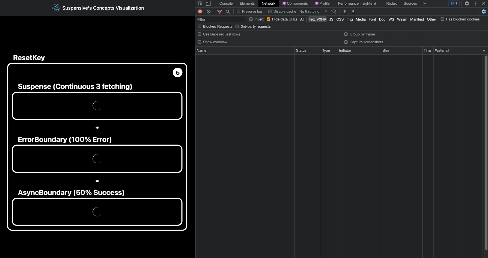

I made [Concepts Visualization](https://visualization.suspensive.org/react) that whoever can understand core concepts of Suspensive(Suspense, ErrorBoundary, AsyncBoundary, ErrorBoundaryGroup) visually. You can interact this site now.

## First, See how boundaries do

1. How [Suspense](https://react.suspensive.org/docs/reference/Suspense) treat loading and success at once in multiple fetching.
2. How [ErrorBoundary](https://react.suspensive.org/docs/reference/ErrorBoundary) treat error at once and how to reset. and what resetKeys do.
3. How [AsyncBoundary](https://react.suspensive.org/docs/reference/AsyncBoundary) treat loading, success and error at once.
4. How [ErrorBoundaryGroup](https://react.suspensive.org/docs/reference/ErrorBoundary#errorboundarygroup) reset multiple ErrorBoundaries without using resetKeys easily.

[**🔗 Click here to see Visualization**](https://visualization.suspensive.org/react)

[**🔗 Click here to see Repository containing source with Suspensive**](https://github.com/suspensive/visualization.suspensive.org/blob/main/pages/react.tsx)

