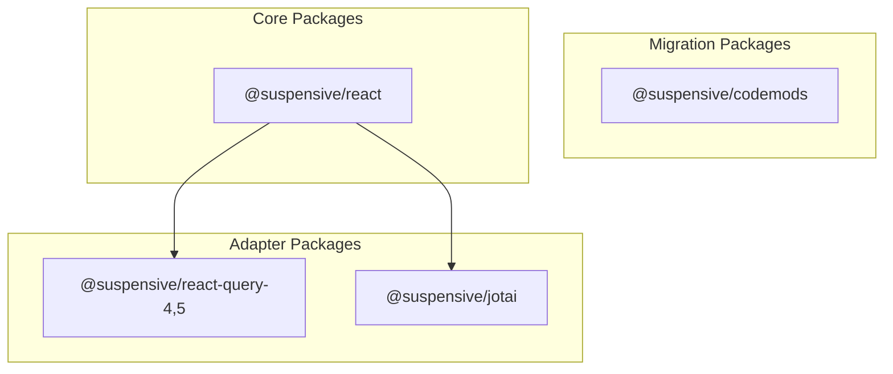
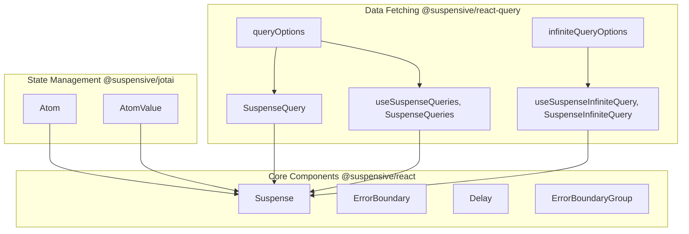

import { Table } from 'nextra/components'
import { LogoImage, TrustedBy } from '@/components'

  <LogoImage size={2.4} />

Suspensive is a comprehensive collection of libraries designed to simplify and enhance the use of React Suspense. Suspensive contains several packages that provide components, hooks, and utilities to streamline the implementation of suspense-based features, error handling, and integrations with popular data fetching libraries.

## Purpose

The Suspensive libraries address common challenges developers face when working with React Suspense, such as:

- Managing loading states and timing
- Implementing robust error boundaries
- Integrating suspense with data fetching libraries
- Coordinating multiple suspense and error boundaries
- Creating viewport-aware components with suspense capabilities

By providing a unified, declarative API for these concerns, Suspensive helps developers create more resilient and better-structured React applications with significantly less boilerplate code.

## Core Packages

### Package Responsibilities

 

<Table>
  <thead>
    <Table.Tr>
      <Table.Th>Package</Table.Th>
      <Table.Th>Description</Table.Th>
      <Table.Th>Key Features</Table.Th>
    </Table.Tr>
  </thead>
  <tbody>
    <Table.Tr>
      <Table.Td>@suspensive/react</Table.Td>
      <Table.Td>Core suspense components</Table.Td>
      <Table.Td>ErrorBoundary, Suspense, Delay, ErrorBoundaryGroup</Table.Td>
    </Table.Tr>
    <Table.Tr>
      <Table.Td>@suspensive/react-query-4,5</Table.Td>
      <Table.Td>TanStack Query integration</Table.Td>
      <Table.Td>
        SuspenseQuery, SuspenseInfiniteQuery, QueriesHydration
      </Table.Td>
    </Table.Tr>
    <Table.Tr>
      <Table.Td>@suspensive/jotai</Table.Td>
      <Table.Td>Jotai integration</Table.Td>
      <Table.Td>useAtomValue, useAtom, useSetAtom</Table.Td>
    </Table.Tr>
    <Table.Tr>
      <Table.Td>@suspensive/codemods</Table.Td>
      <Table.Td>Migration utilities</Table.Td>
      <Table.Td>Automated code transformations</Table.Td>
    </Table.Tr>
  </tbody>
</Table>

## Architecture and Component Relationships

The Suspensive ecosystem is built on a foundation of core components from @suspensive/react, which are then extended and specialized by other packages:

## Version Support and Compatibility

Suspensive is designed to work with:

- React 18 and React 19
- TanStack Query v4 and v5
- Jotai v2

## Key Benefits

- **Declarative Error Handling**: Replace try/catch blocks with component-based error boundaries
- **Simplified Data Fetching**: Integrate seamlessly with TanStack Query using suspense
- **Coordinated Error Management**: Group and reset multiple error boundaries together
- **Controlled Loading States**: Fine-tune loading indicators with timing controls
- **Viewport Awareness**: Trigger loading or animations based on viewport visibility

<TrustedBy
  title="Trusted by"
  description="Used by teams at these companies"
  callToActionText="Using Suspensive at your company?"
  addCompanyButtonText="Add your company"
/>
