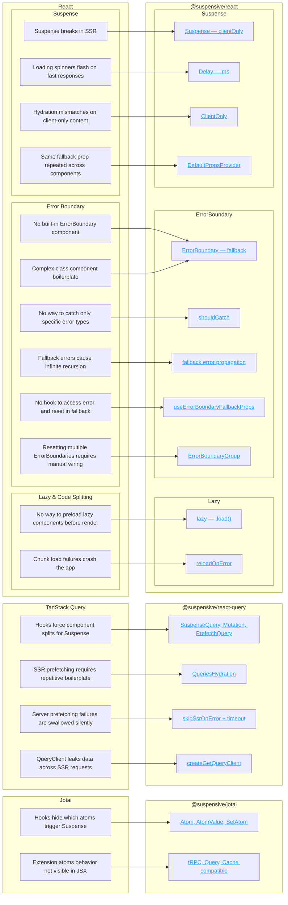

import { LogoImage, TrustedBy } from '@/components'

  <LogoImage size={2.4} />

React gives you Suspense, lazy, and an interface to build Error Boundaries. But if you've tried to use them in a real application, you know the gaps — Suspense breaks in SSR, implementing Error Boundaries from scratch requires boilerplate, and there's no way to coordinate any of it. Beyond React itself, data-fetching libraries and state managers have their own gaps too.

**Suspensive fills those gaps.** It provides declarative components and hooks that make async rendering, error handling, and data fetching work the way they should — with less code and fewer workarounds.

```mermaid
graph LR;
subgraph GAP1 ["React"]
direction TB
subgraph GAP1_S ["Suspense"]
direction TB
A["Suspense breaks in SSR"]
D["Loading spinners flash on fast responses"]
E["Hydration mismatches on client-only content"]
F["Same fallback prop repeated across components"]
end
subgraph GAP1_E ["Error Boundary"]
direction TB
B1["No built-in ErrorBoundary component"]
B2["Complex class component boilerplate"]
B3["Fallback errors cause infinite recursion"]
B4["No way to catch only specific error types"]
B5["No hook to access error and reset in fallback"]
C["Resetting multiple ErrorBoundaries requires manual wiring"]
end
subgraph GAP1_L ["Lazy & Code Splitting"]
direction TB
G["No way to preload lazy components before render"]
G2["Chunk load failures crash the app"]
end
end
subgraph GAP2 ["TanStack Query"]
direction TB
H["Hooks force component splits for Suspense"]
I["SSR prefetching requires repetitive boilerplate"]
J["Server prefetching failures are swallowed silently"]
K["QueryClient leaks data across SSR requests"]
end
subgraph GAP3 ["Jotai"]
direction TB
L["Hooks hide which atoms trigger Suspense"]
M["Extension atoms behavior not visible in JSX"]
end
subgraph JOTAI ["@suspensive/jotai"]
direction TB
Z["Atom, AtomValue, SetAtom"]
Y["tRPC, Query, Cache compatible"]
end
subgraph RQ ["@suspensive/react-query"]
direction TB
W["SuspenseQuery, Mutation, PrefetchQuery"]
V["QueriesHydration"]
U["skipSsrOnError + timeout"]
T["createGetQueryClient"]
end
subgraph REACT ["@suspensive/react"]
direction TB
subgraph REACT_L ["Lazy"]
direction TB
LL["lazy — .load()"]
LL2["reloadOnError"]
end
subgraph REACT_E ["ErrorBoundary"]
direction TB
R["ErrorBoundary — fallback"]
R2["shouldCatch"]
R3["fallback error propagation"]
R4["useErrorBoundaryFallbackProps"]
Q["ErrorBoundaryGroup"]
end
subgraph REACT_S ["Suspense"]
direction TB
S["Suspense — clientOnly"]
P["Delay — ms"]
O["ClientOnly"]
N["DefaultPropsProvider"]
end
end
A --> S
D --> P
E --> O
F --> N
B1 --> R
B2 --> R
B3 --> R3
B4 --> R2
B5 --> R4
C --> Q
G --> LL
G2 --> LL2
H --> W
I --> V
J --> U
K --> T
L --> Z
M --> Y
click S "/docs/react/Suspense"
click P "/docs/react/Delay"
click O "/docs/react/ClientOnly"
click N "/docs/react/DefaultPropsProvider"
click R "/docs/react/ErrorBoundary"
click R2 "/docs/react/ErrorBoundary"
click R3 "/docs/react/ErrorBoundary"
click R4 "/docs/react/ErrorBoundary"
click Q "/docs/react/ErrorBoundaryGroup"
click LL "/docs/react/lazy"
click LL2 "/docs/react/lazy"
click W "/docs/react-query/SuspenseQuery"
click V "/docs/react-query/QueriesHydration"
click U "/docs/react-query/QueriesHydration"
click T "/docs/react-query/createGetQueryClient"
click Z "/docs/jotai/Atom"
click Y "/docs/jotai/Atom"
style S color:#1AA3FF,text-decoration:underline
style P color:#1AA3FF,text-decoration:underline
style O color:#1AA3FF,text-decoration:underline
style N color:#1AA3FF,text-decoration:underline
style R color:#1AA3FF,text-decoration:underline
style R2 color:#1AA3FF,text-decoration:underline
style R3 color:#1AA3FF,text-decoration:underline
style R4 color:#1AA3FF,text-decoration:underline
style Q color:#1AA3FF,text-decoration:underline
style LL color:#1AA3FF,text-decoration:underline
style LL2 color:#1AA3FF,text-decoration:underline
style W color:#1AA3FF,text-decoration:underline
style V color:#1AA3FF,text-decoration:underline
style U color:#1AA3FF,text-decoration:underline
style T color:#1AA3FF,text-decoration:underline
style Z color:#1AA3FF,text-decoration:underline
style Y color:#1AA3FF,text-decoration:underline
```

<TrustedBy
  title="Trusted by"
  description="Used by teams at these companies"
  callToActionText="Using Suspensive at your company?"
  addCompanyButtonText="Add your company"
/>
