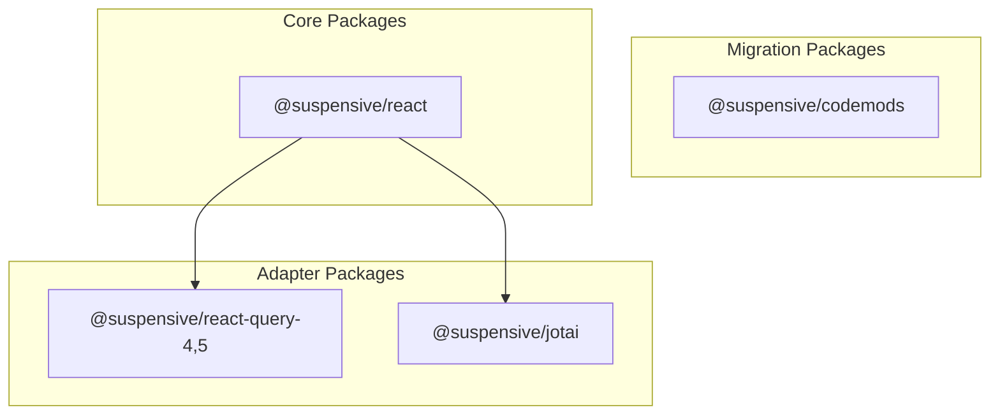
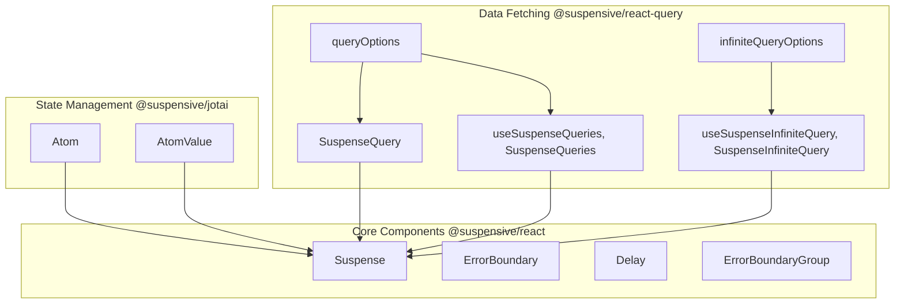

import Link from 'next/link'
import { Callout, LogoImage, TrustedBy } from '@/components'

  <LogoImage size={2.4} />

React gives you Suspense, lazy, and an interface to build Error Boundaries. But if you've tried to use them in a real application, you know the gaps — Suspense breaks in SSR, implementing Error Boundaries from scratch requires boilerplate, and there's no way to coordinate any of it. Beyond React itself, data-fetching libraries and state managers have their own gaps too.

**Suspensive fills those gaps.** It provides declarative components and hooks that make async rendering, error handling, and data fetching work the way they should — with less code and fewer workarounds.

```mermaid
graph TD;
    subgraph DD ["Migration Packages"]
        E["@suspensive/codemods"]
    end
    subgraph AA ["Core Packages"]
        A["@suspensive/react"]
    end
    subgraph BB ["Adapter Packages"]
        C["@suspensive/react-query-4,5"]
        D["@suspensive/jotai"]
    end

    A --> C
    A --> D
```

<Callout type="info">

**Ready to get started?** Follow the [Getting Started guide](/docs/react/getting-started) to set up Suspensive in 5 minutes, or see how it compares to [react-error-boundary](/docs/react/comparison).

<Table>
  <thead>
    <Table.Tr>
      <Table.Th>Package</Table.Th>
      <Table.Th>Description</Table.Th>
      <Table.Th>Key Features</Table.Th>
    </Table.Tr>
  </thead>
  <tbody>
    <Table.Tr>
      <Table.Td>@suspensive/react</Table.Td>
      <Table.Td>Core suspense components</Table.Td>
      <Table.Td>ErrorBoundary, Suspense, Delay, ErrorBoundaryGroup</Table.Td>
    </Table.Tr>
    <Table.Tr>
      <Table.Td>@suspensive/react-query-4,5</Table.Td>
      <Table.Td>TanStack Query integration</Table.Td>
      <Table.Td>
        SuspenseQuery, SuspenseInfiniteQuery, QueriesHydration
      </Table.Td>
    </Table.Tr>
    <Table.Tr>
      <Table.Td>@suspensive/jotai</Table.Td>
      <Table.Td>Jotai integration</Table.Td>
      <Table.Td>useAtomValue, useAtom, useSetAtom</Table.Td>
    </Table.Tr>
    <Table.Tr>
      <Table.Td>@suspensive/codemods</Table.Td>
      <Table.Td>Migration utilities</Table.Td>
      <Table.Td>Automated code transformations</Table.Td>
    </Table.Tr>
  </tbody>
</Table>

## Architecture and Component Relationships

The Suspensive ecosystem is built on a foundation of core components from @suspensive/react, which are then extended and specialized by other packages:

```mermaid
graph TD;
subgraph AA [Data Fetching @suspensive/react-query]
A[queryOptions];
B[infiniteQueryOptions];
C[SuspenseQuery];
D[useSuspenseInfiniteQuery, SuspenseInfiniteQuery];
E[useSuspenseQueries, SuspenseQueries];
end
subgraph BB [State Management @suspensive/jotai]
F[Atom];
G[AtomValue];
end
subgraph CC [Core Components @suspensive/react]
H[Suspense];
I[ErrorBoundary];
J[Delay];
K[ErrorBoundaryGroup];
end

C --> H;
D --> H;
E --> H;
F --> H;
G --> H;

A --> C;
A --> E;
B --> D;
```

## Version Support and Compatibility

Suspensive is designed to work with:

- React 18 and React 19
- TanStack Query v4 and v5
- Jotai v2

## Key Benefits

- **Declarative Error Handling**: Replace try/catch blocks with component-based error boundaries
- **Simplified Data Fetching**: Integrate seamlessly with TanStack Query using suspense
- **Coordinated Error Management**: Group and reset multiple error boundaries together
- **Controlled Loading States**: Fine-tune loading indicators with timing controls
- **Viewport Awareness**: Trigger loading or animations based on viewport visibility

<TrustedBy
  title="Trusted by"
  description="Used by teams at these companies"
  callToActionText="Using Suspensive at your company?"
  addCompanyButtonText="Add your company"
/>
