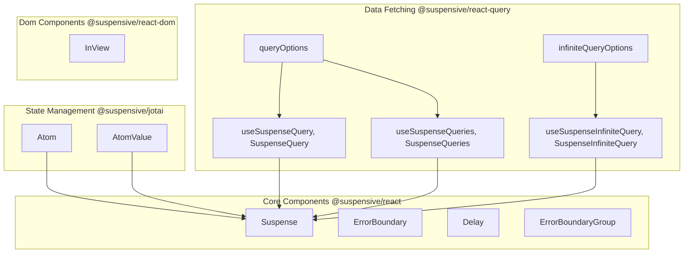
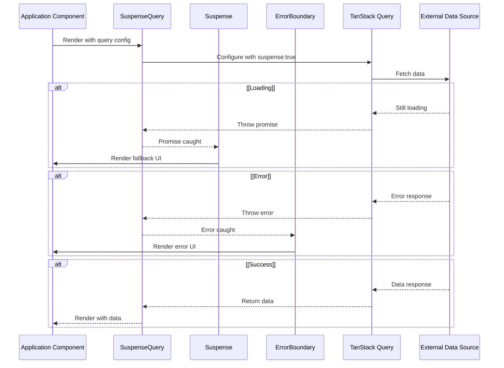

import Image from 'next/image'
import { Table } from 'nextra/components'

<Image
  width={330 * 2.4}
  height={43.7 * 2.4}
  src="/img/logo-suspensive-text-progressive-blur.svg"
  unoptimized
  alt="Suspensive"
  className="my-20 px-24 md:my-40"
/>

Suspensive는 React Suspense 사용을 간소화하고 향상시키도록 설계된 포괄적인 라이브러리 모음입니다. Suspensive에는 Suspense 기반 기능 구현, 오류 처리 및 인기 있는 데이터 가져오기 라이브러리와의 통합을 간소화하는 컴포넌트, 후크 및 유틸리티를 제공하는 여러 패키지가 포함되어 있습니다.

## 목적

Suspensive는 다음과 같은 공통적인 도전을 해결하기 위해 설계되었습니다:

- 로딩 상태와 타이밍 관리
- 강력한 오류 경계 구현
- 비동기 상태 통합을 위한 오류 관리
- 여러 오류 경계의 조정
- 뷰포트 인식 구성 요소 만들기

Suspensive는 이러한 문제에 대한 통합적이고 선언적인 API를 제공함으로써 개발자가 훨씬 적은 보일러플레이트 코드로 보다 탄력적이고 구조화된 React 애플리케이션을 만들 수 있도록 돕습니다.

## 핵심 패키지

```mermaid
graph TD;
subgraph DD [Migration Packages]
E[@suspensive/codemods];
end
subgraph AA [Core Packages]
A[@suspensive/react];
end
subgraph BB [Adapter Packages]
B[@suspensive/react-dom];
C[@suspensive/react-query];
D[@suspensive/jotai];
end
subgraph CC [Version-Specific Packages]
F[@suspensive/react-query-4];
G[@suspensive/react-query-5];
end

A --> B;
A --> C;
A --> D;

C --> F;
C --> G;
```

### 패키지 책임

<br />

<Table>
  <thead>
    <Table.Tr>
      <Table.Th>Package</Table.Th>
      <Table.Th>Description</Table.Th>
      <Table.Th>Key Features</Table.Th>
    </Table.Tr>
  </thead>
  <tbody>
    <Table.Tr>
      <Table.Td>@suspensive/react</Table.Td>
      <Table.Td>Core suspense components</Table.Td>
      <Table.Td>ErrorBoundary, Suspense, Delay, ErrorBoundaryGroup</Table.Td>
    </Table.Tr>
    <Table.Tr>
      <Table.Td>@suspensive/react-dom</Table.Td>
      <Table.Td>DOM-specific components</Table.Td>
      <Table.Td>InView</Table.Td>
    </Table.Tr>
    <Table.Tr>
      <Table.Td>@suspensive/react-query</Table.Td>
      <Table.Td>TanStack Query integration</Table.Td>
      <Table.Td>
        SuspenseQuery, SuspenseInfiniteQuery, Version detection
      </Table.Td>
    </Table.Tr>
    <Table.Tr>
      <Table.Td>@suspensive/jotai</Table.Td>
      <Table.Td>Jotai integration</Table.Td>
      <Table.Td>useAtomValue, useAtom, useSetAtom</Table.Td>
    </Table.Tr>
    <Table.Tr>
      <Table.Td>@suspensive/codemods</Table.Td>
      <Table.Td>Migration utilities</Table.Td>
      <Table.Td>Automated code transformations</Table.Td>
    </Table.Tr>
  </tbody>
</Table>

## 아키텍처 및 구성 요소 관계

Suspensive 생태계는 @suspensive/react에서 기본 구성 요소를 기반으로 구축되어 있으며, 이 구성 요소는 다른 패키지에서 확장 및 특화됩니다:



## 버전 지원 및 호환성

Suspensive는 다음과 같은 버전의 종속성을 지원합니다:

- React 18 및 React 19
- TanStack Query v4 및 v5
- Jotai v2

이 라이브러리는 이러한 종속성의 자동 어댑트를 통해 설치된 특정 버전에 맞게 자동으로 적용됩니다.

## 데이터 흐름 패턴

Suspensive에서는 React Suspense를 통한 비동기 상태 처리를 중심으로 하는 패턴을 따릅니다. 다음은 SuspenseQuery 같은 구성 요소를 사용할 때 데이터가 흐르는 방식을 보여주는 시퀀스 다이어그램입니다:



## 주요 이점

- **선언적 오류 처리**: try/catch 블록 대신 구성 요소 기반 오류 경계
- **간소화된 데이터 가져오기**: TanStack Query 사용 시 비동기 상태 통합
- **조정된 오류 관리**: 여러 오류 경계 조정
- **제어된 로딩 상태**: 타이밍 컨트롤을 통한 로딩 인디케이터 세밀 조정
- **뷰포트 인식 구성 요소**: 뷰포트 인식 구성 요소 만들기
