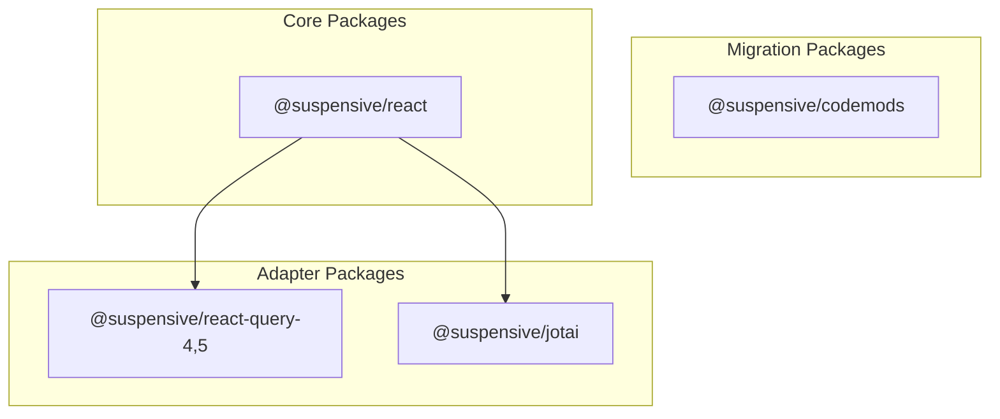
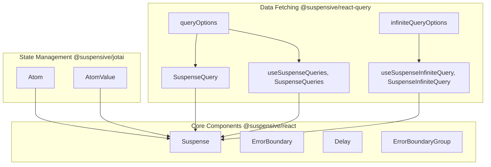

import Image from 'next/image'
import { Table } from 'nextra/components'
import { LogoImage, TrustedBy } from '@/components'

  <LogoImage size={2.4} />

Suspensive는 React Suspense 사용을 간소화하고 향상시키도록 설계된 포괄적인 라이브러리 모음입니다. Suspensive에는 Suspense 기반 기능 구현, 오류 처리 및 인기 있는 데이터 가져오기 라이브러리와의 통합을 간소화하는 컴포넌트, 후크 및 유틸리티를 제공하는 여러 패키지가 포함되어 있습니다.

## 목적

Suspensive는 다음과 같은 공통적인 도전을 해결하기 위해 설계되었습니다:

- 로딩 상태와 타이밍 관리
- 강력한 오류 경계 구현
- 비동기 상태 통합을 위한 오류 관리
- 여러 오류 경계의 조정
- 뷰포트 인식 구성 요소 만들기

Suspensive는 이러한 문제에 대한 통합적이고 선언적인 API를 제공함으로써 개발자가 훨씬 적은 보일러플레이트 코드로 보다 탄력적이고 구조화된 React 애플리케이션을 만들 수 있도록 돕습니다.

## 핵심 패키지

### 패키지 책임

 

<Table>
  <thead>
    <Table.Tr>
      <Table.Th>Package</Table.Th>
      <Table.Th>Description</Table.Th>
      <Table.Th>Key Features</Table.Th>
    </Table.Tr>
  </thead>
  <tbody>
    <Table.Tr>
      <Table.Td>@suspensive/react</Table.Td>
      <Table.Td>Core suspense components</Table.Td>
      <Table.Td>ErrorBoundary, Suspense, Delay, ErrorBoundaryGroup</Table.Td>
    </Table.Tr>
    <Table.Tr>
      <Table.Td>@suspensive/react-query-4,5</Table.Td>
      <Table.Td>TanStack Query integration</Table.Td>
      <Table.Td>
        SuspenseQuery, SuspenseInfiniteQuery, QueriesHydration
      </Table.Td>
    </Table.Tr>
    <Table.Tr>
      <Table.Td>@suspensive/jotai</Table.Td>
      <Table.Td>Jotai integration</Table.Td>
      <Table.Td>useAtomValue, useAtom, useSetAtom</Table.Td>
    </Table.Tr>
    <Table.Tr>
      <Table.Td>@suspensive/codemods</Table.Td>
      <Table.Td>Migration utilities</Table.Td>
      <Table.Td>Automated code transformations</Table.Td>
    </Table.Tr>
  </tbody>
</Table>

## 아키텍처 및 구성 요소 관계

Suspensive 생태계는 @suspensive/react에서 기본 구성 요소를 기반으로 구축되어 있으며, 이 구성 요소는 다른 패키지에서 확장 및 특화됩니다:

## 버전 지원 및 호환성

Suspensive는 다음과 같은 버전의 종속성을 지원합니다:

- React 18 및 React 19
- TanStack Query v4 및 v5
- Jotai v2

## 주요 이점

- **선언적 오류 처리**: try/catch 블록 대신 구성 요소 기반 오류 경계
- **간소화된 데이터 가져오기**: TanStack Query 사용 시 비동기 상태 통합
- **조정된 오류 관리**: 여러 오류 경계 조정
- **제어된 로딩 상태**: 타이밍 컨트롤을 통한 로딩 인디케이터 세밀 조정
- **뷰포트 인식 구성 요소**: 뷰포트 인식 구성 요소 만들기

<TrustedBy
  title="사용 중인 기업"
  description="다음 기업에서 Suspensive를 사용하고 있습니다"
  callToActionText="귀사에서 Suspensive를 사용하고 계신가요?"
  addCompanyButtonText="회사 정보를 추가해주세요"
/>
