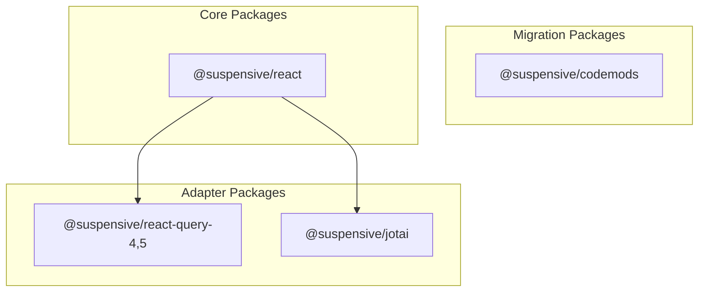
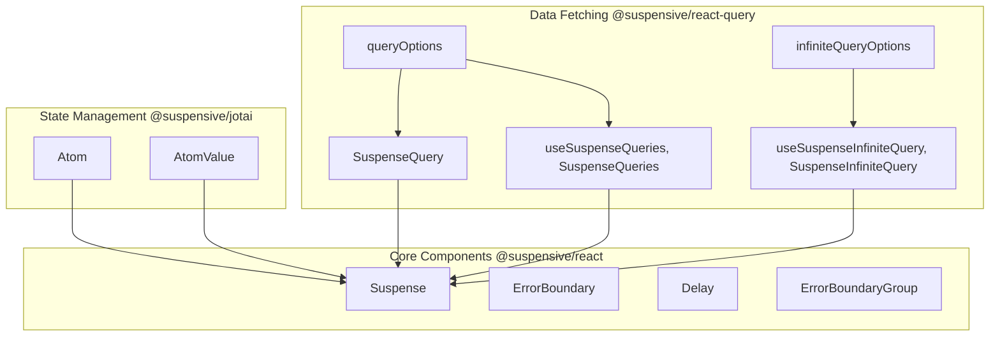

import Link from 'next/link'
import { Callout, LogoImage, TrustedBy } from '@/components'

  <LogoImage size={2.4} />

React에는 Suspense와 lazy가 있고, Error Boundary를 구현할 수 있는 인터페이스를 제공합니다. 하지만 실제 애플리케이션에서 사용해 보면 빈틈이 드러납니다 — Suspense는 SSR에서 깨지고, Error Boundary는 직접 구현하려면 보일러플레이트가 많고, 이 모든 것을 조율할 방법이 없습니다. React뿐 아니라, 데이터 페칭 라이브러리와 상태 관리 라이브러리에도 각각의 빈틈이 있습니다.

**Suspensive는 그 빈틈을 채웁니다.** 비동기 렌더링, 에러 처리, 데이터 페칭이 더 적은 코드와 더 적은 우회로 제대로 동작하도록 선언적 컴포넌트와 훅을 제공합니다.

```mermaid
graph TD;
    subgraph DD ["Migration Packages"]
        E["@suspensive/codemods"]
    end
    subgraph AA ["Core Packages"]
        A["@suspensive/react"]
    end
    subgraph BB ["Adapter Packages"]
        C["@suspensive/react-query-4,5"]
        D["@suspensive/jotai"]
    end

    A --> C
    A --> D
```

<Callout type="info">

**시작할 준비가 되셨나요?** [시작하기 가이드](/docs/react/getting-started)를 따라 5분 만에 Suspensive를 설정하거나, [react-error-boundary와의 비교](/docs/react/comparison)를 확인하세요.

<Table>
  <thead>
    <Table.Tr>
      <Table.Th>Package</Table.Th>
      <Table.Th>Description</Table.Th>
      <Table.Th>Key Features</Table.Th>
    </Table.Tr>
  </thead>
  <tbody>
    <Table.Tr>
      <Table.Td>@suspensive/react</Table.Td>
      <Table.Td>Core suspense components</Table.Td>
      <Table.Td>ErrorBoundary, Suspense, Delay, ErrorBoundaryGroup</Table.Td>
    </Table.Tr>
    <Table.Tr>
      <Table.Td>@suspensive/react-query-4,5</Table.Td>
      <Table.Td>TanStack Query integration</Table.Td>
      <Table.Td>
        SuspenseQuery, SuspenseInfiniteQuery, QueriesHydration
      </Table.Td>
    </Table.Tr>
    <Table.Tr>
      <Table.Td>@suspensive/jotai</Table.Td>
      <Table.Td>Jotai integration</Table.Td>
      <Table.Td>useAtomValue, useAtom, useSetAtom</Table.Td>
    </Table.Tr>
    <Table.Tr>
      <Table.Td>@suspensive/codemods</Table.Td>
      <Table.Td>Migration utilities</Table.Td>
      <Table.Td>Automated code transformations</Table.Td>
    </Table.Tr>
  </tbody>
</Table>

## 아키텍처 및 구성 요소 관계

Suspensive 생태계는 @suspensive/react에서 기본 구성 요소를 기반으로 구축되어 있으며, 이 구성 요소는 다른 패키지에서 확장 및 특화됩니다:

```mermaid
graph TD;
subgraph AA [Data Fetching @suspensive/react-query]
A[queryOptions];
B[infiniteQueryOptions];
C[SuspenseQuery];
D[useSuspenseInfiniteQuery, SuspenseInfiniteQuery];
E[useSuspenseQueries, SuspenseQueries];
end
subgraph BB [State Management @suspensive/jotai]
F[Atom];
G[AtomValue];
end
subgraph CC [Core Components @suspensive/react]
H[Suspense];
I[ErrorBoundary];
J[Delay];
K[ErrorBoundaryGroup];
end

C --> H;
D --> H;
E --> H;
F --> H;
G --> H;

A --> C;
A --> E;
B --> D;
```

## 버전 지원 및 호환성

Suspensive는 다음과 같은 버전의 종속성을 지원합니다:

- React 18 및 React 19
- TanStack Query v4 및 v5
- Jotai v2

## 주요 이점

- **선언적 오류 처리**: try/catch 블록 대신 구성 요소 기반 오류 경계
- **간소화된 데이터 가져오기**: TanStack Query 사용 시 비동기 상태 통합
- **조정된 오류 관리**: 여러 오류 경계 조정
- **제어된 로딩 상태**: 타이밍 컨트롤을 통한 로딩 인디케이터 세밀 조정
- **뷰포트 인식 구성 요소**: 뷰포트 인식 구성 요소 만들기

<TrustedBy
  title="사용 중인 기업"
  description="다음 기업에서 Suspensive를 사용하고 있습니다"
  callToActionText="귀사에서 Suspensive를 사용하고 계신가요?"
  addCompanyButtonText="회사 정보를 추가해주세요"
/>
