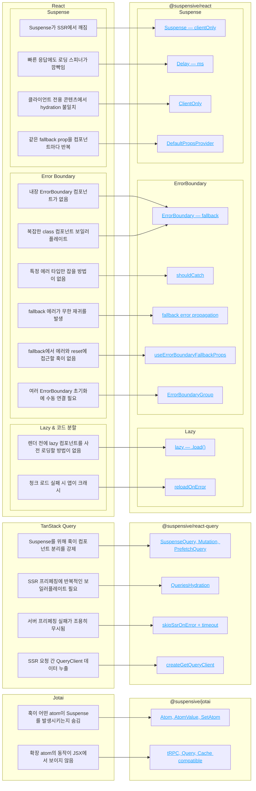

import Link from 'next/link'
import { Callout, LogoImage, TrustedBy } from '@/components'

  <LogoImage size={2.4} />

React에는 Suspense와 lazy가 있고, Error Boundary를 구현할 수 있는 인터페이스를 제공합니다. 하지만 실제 애플리케이션에서 사용해 보면 빈틈이 드러납니다 — Suspense는 SSR에서 깨지고, Error Boundary는 직접 구현하려면 보일러플레이트가 많고, 이 모든 것을 조율할 방법이 없습니다. React뿐 아니라, 데이터 페칭 라이브러리와 상태 관리 라이브러리에도 각각의 빈틈이 있습니다.

**Suspensive는 그 빈틈을 채웁니다.** 비동기 렌더링, 에러 처리, 데이터 페칭이 더 적은 코드와 더 적은 우회로 제대로 동작하도록 선언적 컴포넌트와 훅을 제공합니다.

```mermaid
graph LR;
subgraph GAP1 ["React"]
direction TB
subgraph GAP1_S ["Suspense"]
direction TB
A["Suspense가 SSR에서 깨짐"]
D["빠른 응답에도 로딩 스피너가 깜빡임"]
E["클라이언트 전용 콘텐츠에서 hydration 불일치"]
F["같은 fallback prop을 컴포넌트마다 반복"]
end
subgraph GAP1_E ["Error Boundary"]
direction TB
B1["내장 ErrorBoundary 컴포넌트가 없음"]
B2["복잡한 class 컴포넌트 보일러플레이트"]
B3["fallback 에러가 무한 재귀를 발생"]
B4["특정 에러 타입만 잡을 방법이 없음"]
B5["fallback에서 에러와 reset에 접근할 훅이 없음"]
C["여러 ErrorBoundary 초기화에 수동 연결 필요"]
end
subgraph GAP1_L ["Lazy & 코드 분할"]
direction TB
G["렌더 전에 lazy 컴포넌트를 사전 로딩할 방법이 없음"]
G2["청크 로드 실패 시 앱이 크래시"]
end
end
subgraph GAP2 ["TanStack Query"]
direction TB
H["Suspense를 위해 훅이 컴포넌트 분리를 강제"]
I["SSR 프리페칭에 반복적인 보일러플레이트 필요"]
J["서버 프리페칭 실패가 조용히 무시됨"]
K["SSR 요청 간 QueryClient 데이터 누출"]
end
subgraph GAP3 ["Jotai"]
direction TB
L["훅이 어떤 atom이 Suspense를 발생시키는지 숨김"]
M["확장 atom의 동작이 JSX에서 보이지 않음"]
end
subgraph JOTAI ["@suspensive/jotai"]
direction TB
Z["Atom, AtomValue, SetAtom"]
Y["tRPC, Query, Cache compatible"]
end
subgraph RQ ["@suspensive/react-query"]
direction TB
W["SuspenseQuery, Mutation, PrefetchQuery"]
V["QueriesHydration"]
U["skipSsrOnError + timeout"]
T["createGetQueryClient"]
end
subgraph REACT ["@suspensive/react"]
direction TB
subgraph REACT_L ["Lazy"]
direction TB
LL["lazy — .load()"]
LL2["reloadOnError"]
end
subgraph REACT_E ["ErrorBoundary"]
direction TB
R["ErrorBoundary — fallback"]
R2["shouldCatch"]
R3["fallback error propagation"]
R4["useErrorBoundaryFallbackProps"]
Q["ErrorBoundaryGroup"]
end
subgraph REACT_S ["Suspense"]
direction TB
S["Suspense — clientOnly"]
P["Delay — ms"]
O["ClientOnly"]
N["DefaultPropsProvider"]
end
end
A --> S
D --> P
E --> O
F --> N
B1 --> R
B2 --> R
B3 --> R3
B4 --> R2
B5 --> R4
C --> Q
G --> LL
G2 --> LL2
H --> W
I --> V
J --> U
K --> T
L --> Z
M --> Y
click S "/docs/react/Suspense"
click P "/docs/react/Delay"
click O "/docs/react/ClientOnly"
click N "/docs/react/DefaultPropsProvider"
click R "/docs/react/ErrorBoundary"
click R2 "/docs/react/ErrorBoundary"
click R3 "/docs/react/ErrorBoundary"
click R4 "/docs/react/ErrorBoundary"
click Q "/docs/react/ErrorBoundaryGroup"
click LL "/docs/react/lazy"
click LL2 "/docs/react/lazy"
click W "/docs/react-query/SuspenseQuery"
click V "/docs/react-query/QueriesHydration"
click U "/docs/react-query/QueriesHydration"
click T "/docs/react-query/createGetQueryClient"
click Z "/docs/jotai/Atom"
click Y "/docs/jotai/Atom"
style S color:#1AA3FF,text-decoration:underline
style P color:#1AA3FF,text-decoration:underline
style O color:#1AA3FF,text-decoration:underline
style N color:#1AA3FF,text-decoration:underline
style R color:#1AA3FF,text-decoration:underline
style R2 color:#1AA3FF,text-decoration:underline
style R3 color:#1AA3FF,text-decoration:underline
style R4 color:#1AA3FF,text-decoration:underline
style Q color:#1AA3FF,text-decoration:underline
style LL color:#1AA3FF,text-decoration:underline
style LL2 color:#1AA3FF,text-decoration:underline
style W color:#1AA3FF,text-decoration:underline
style V color:#1AA3FF,text-decoration:underline
style U color:#1AA3FF,text-decoration:underline
style T color:#1AA3FF,text-decoration:underline
style Z color:#1AA3FF,text-decoration:underline
style Y color:#1AA3FF,text-decoration:underline
```

<Callout type="info">

**시작할 준비가 되셨나요?** [시작하기 가이드](/docs/react/getting-started)를 따라 5분 만에 Suspensive를 설정하거나, [react-error-boundary와의 비교](/docs/react/comparison)를 확인하세요.

</Callout>

<TrustedBy text="월간 다운로드 130k+" />
